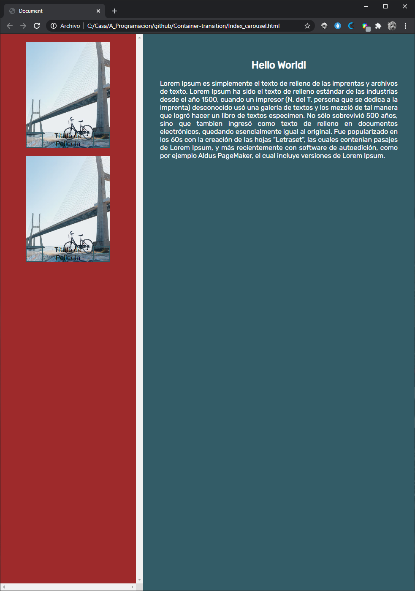

# Container-transition

# Details

- This is just a sample of a container transition

## Built With

- HTML5
- CSS3

## Getting Started

**This project was created for the sole purpose of understanding how transition works.**

## Built With

- HTML5 
- CSS
- VSC

## Live Demo

[Live Demo Link](https://wusinho.github.io/Container-transition/)

👤 **Heber Lazo**

- [@lazo_heber](https://www.linkedin.com/in/heber-lazo-benza-523266133/) [][linkedin]

- [@lazo_heber](https://twitter.com/lazo_heber) [][twitter]

## 🤝 Contributing

Contributions, issues, and feature requests are welcome!

Feel free to check the [issues page](https://github.com/Wusinho/Container-transition/issues).

## Show your support

Give a ⭐️ if you like this project!

## 📝 License

This project is [MIT](LICENSE) licensed.

[linkedin]: www.linkedin.com/in/heber-lazo
[twitter]: https://twitter.com/lazo_heber
